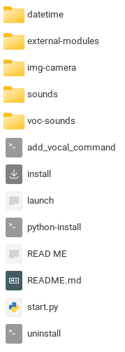

<h1 align="center">MAIA - MyApp AI - v2</h1>
<h4 align="center">Object recognition module and voice recognition/text-to-speech synthesis</h4>

## Status


MAIA (MyApp Intelligence Artificial) is a Python project that enables you to create your own voice-controlled assistant using various Python libraries and modules.


## Table of Contents
- [Introduction](#introduction)
- [Description](#description)
- [Features](#features)
- [Getting Started](#getting-started)
  - [Prerequisites](#prerequisites)
  - [Installation](#installation)
- [Usage](#usage)
  - [Basic Usage](#basic-usage)
  - [Advanced Usage](#advanced-usage)
- [Customizing Your Assistant](#customizing-your-assistant)
  - [Adding Voice Commands](#adding-voice-commands)
  - [Extending Functionality](#extending-functionality)
- [Troubleshooting](#troubleshooting)
- [Contributing](#contributing)
- [License](#license)

## Introduction

MAIA (MyApp Intelligence Artificial) is designed to provide a foundation for building your own voice-controlled assistant with Python. It uses various libraries and modules for speech recognition, text-to-speech synthesis, and custom functionality.


## Description

- The program is designed to run on an x86-64 architecture with an internet connection.

### Files and Folders

**In the 'voc-sounds' folder :**
- `advanced-mode-recognize.py`: Advanced mode recognition.
- `keywords`: Keywords for voice commands.
- `no-co.gram`: Grammar file for no connection.
- `no-co.dict`: Dictionary file for no connection.
- `no-connection-recognition.py`: No connection recognition code.
- `no-connection-speak.py`: No connection speech code.
- `functions.py`: User-defined functions.
- `output.mp3`: MP3 output.
- `output.wav`: WAV output.
- `parole.mp3`: MP3 speech.
- `user-mode.py`: User mode code.


### TODO
- [x] voc-sounds module tests - **ok**
- [-] Camera module integration. **ko**

## Credits

This program uses the following Python modules:

- [SpeechRecognition](https://github.com/Uberi/speech_recognition)
- [pytssx3](https://github.com/nateshmbhat/pyttsx3)


## Features

- Speech recognition using the SpeechRecognition library.
- Text-to-speech synthesis with GTTS and pyttsx3.
- Interactive voice commands and responses.
- Dynamic command addition via a user interface.
- Customizable voice commands.

## Getting Started

### Prerequisites

Before you begin, ensure you have met the following requirements:

- Python 3.9 (You can download it from [Python's official website](https://www.python.org/downloads/))
- Make sure you have `pip` installed. If not, you can follow the installation instructions [here](https://pip.pypa.io/en/stable/installation/).

### Installation

1. Download and unzip the MAIA package:

    [MAIA Download](https://github.com/dadflip/maia/releases/tag/v2.0.0)

2. Install the required Python packages by running the following command in your terminal:

    ```bash
    cd MAIA-V1
    ./install
    ```

## Usage

### Basic Usage

To run the voice-controlled assistant in basic mode, follow these steps:

1. Open a terminal and navigate to the project directory:

    ```bash
    cd /path/to/maia
    ```

2. Run the basic assistant program:

    ```bash
    python3 launch
    ```

3. Follow the on-screen instructions to interact with the assistant using voice commands.

### Advanced Usage

For advanced features, you can launch the advanced assistant program:

1. Run the advanced assistant program:

    ```bash
    python3 recognize.py
    ```

2. The advanced program supports custom voice commands and custom functions. Use the user interface to add new voice commands and associate them with custom Python functions.

## Customizing Your Assistant

### Adding Voice Commands

To add new voice commands:

1. Run the `add_vocal_command.sh` script:

    ```bash
    bash add_vocal_command.sh
    ```

2. Enter the new voice command, the associated function name, and the Python function code in the user interface.

3. The command and function will be added to the `keywords.txt` file and the `functions.py` file, respectively.

### Extending Functionality

To extend the functionality of your assistant, you can create custom functions in the `functions.py` file. These functions should be named according to the associated voice commands.

## Troubleshooting

If you encounter any issues while using the assistant, you can check the Troubleshooting section of the **README.md** file for guidance.

## Contributing

Contributions are welcome! If you'd like to contribute to the project, please follow these steps:

1. Fork the project on GitHub.
2. Create a new branch with a descriptive name.
3. Make your contributions.
4. Submit a pull request.

## License
This project is licensed under the GNU General License - see the **LICENSE** file for details.

**Note**: Make sure to replace `/path/to/maia` with your actual project directory path.

Feel free to add more details, sections, or customize this template further to suit your project's needs. This **README** template covers the essential sections, but you can expand it with additional information as required.
